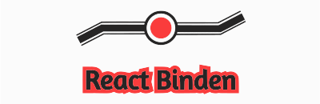

<p align="center">

[](https://app.netlify.com/sites/react-binden/deploys)

[](https://badge.fury.io/js/react-binden)

</p>

A React form handling library that is actually easy

## Installation

React Binden can installed easily with npm/yarn or any node package manager that pulls packages from registry.npmjs.com

With NPM

```bash
$ npm install react-binden
```

With YARN

```bash
$ yarn add react-binden
```

## Documentation

Documentation of React Binden can be found at [react-binden.netlify.app](https://react-binden.netlify.app/)

## Running Locally

To run it locally, git clone the repo

```bash
$ git clone https://github.com/KRTirtho/react-binden.git
$ cd react-binden
```

Then run:

```bash
$ npm install
$ npm run storybook
```

It'll start the storybook server for development/component viewing

## Contribution

Any kind of improving contribution following [CONTRIBUTION.md](#null) is welcomed

## Social

You can find us here:

-   [Twitter](https://twitter.com/@krtirtho)
-   [Github Discussion](https://github.com/KRTirtho/react-binden/discussions)
-   [Blog](http://react-binden.netlify.app/blog)
-   [DEV Community](https://dev.to/krtirtho)
